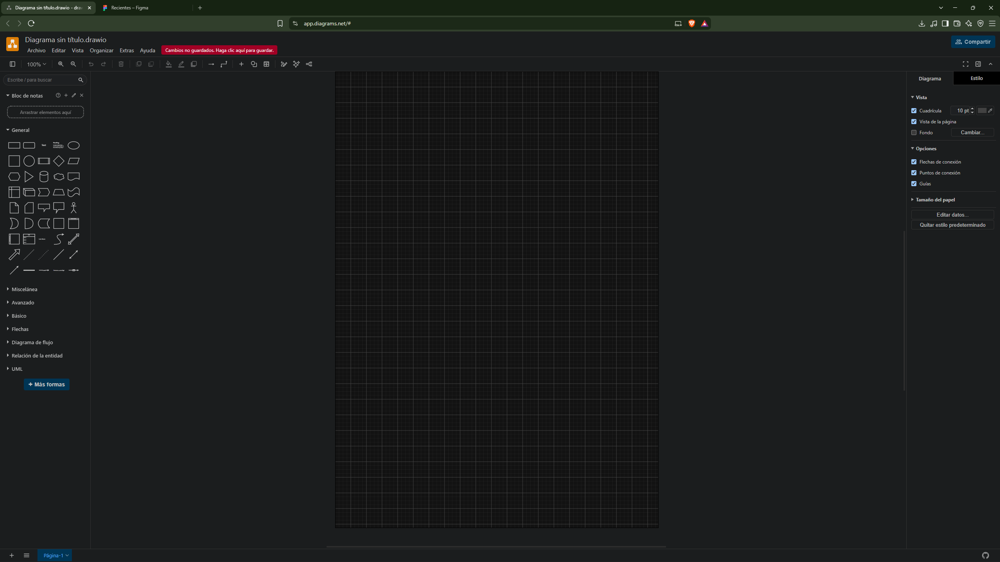
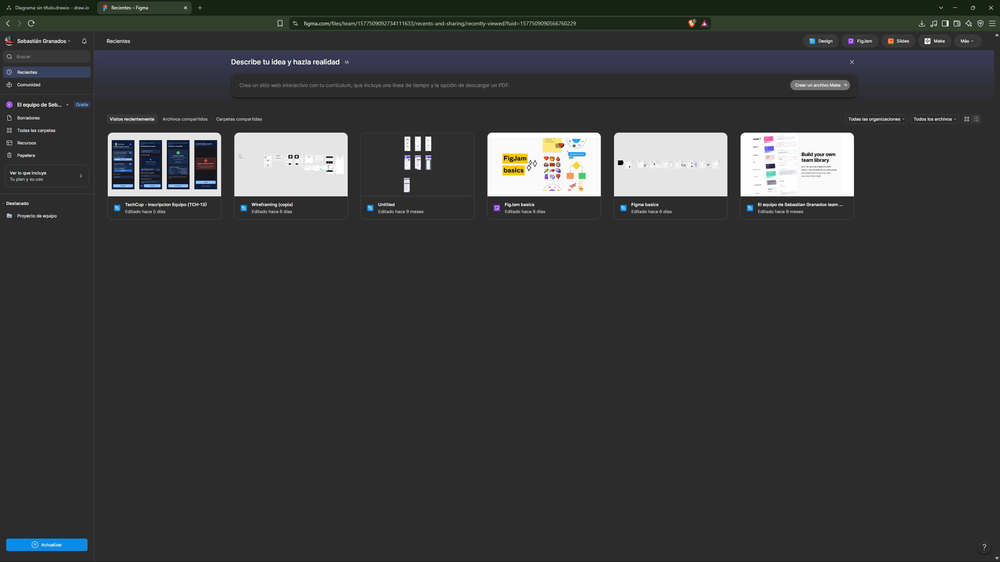

# DOSW_Parcial_T1_SebastianGranados

**Link repositorio Bitacora:** https://github.com/Sebastian-Granados1456/Bitacora.git
**Nombre completo:** Sebastián Camilo Granados López
**Grupo:** DOSW 01

## Enunciado asignado: DOSW Parcial #3

## 1.


## 2. Requerimientos

**Funcionales:**

* Un pedido puede contener hasta 5 productos diferentes, cada uno con sus propios extras. (Builder) 
* Cada pedido se construye seleccionando: un producto base, una o más opciones de personalización (extras) y una preferencia de entrega. (Decorator)
* El sistema debe ser compatible con móvil, tablet y escritorio.

**No Funcionales:**

* Colores de la cafetería: Azul (#1B3A5C) y Dorado (#C67A00).
* Tipografía: Poppins (Google Fonts)

## 3. Diagrama de casos de uso


## 4. Plantilla Anáisis de Requerimientos


---

## Evidencias

### Herramienta de modelado — Draw.io


### Figma


### Proyecto Maven corriendo correctamente
Salida de `mvn test` — compila y ejecuta el test de `AppTest` sin errores
(ver [`docs/images/evidencia_maven_test.txt`](docs/images/evidencia_maven_test.txt)):

```
[INFO] Running edu.dosw.parcial.AppTest
[INFO] Tests run: 1, Failures: 0, Errors: 0, Skipped: 0, Time elapsed: 0.046 s -- in edu.dosw.parcial.AppTest
[INFO]
[INFO] Results:
[INFO]
[INFO] Tests run: 1, Failures: 0, Errors: 0, Skipped: 0
[INFO]
[INFO] ------------------------------------------------------------------------
[INFO] BUILD SUCCESS
[INFO] ------------------------------------------------------------------------
```
